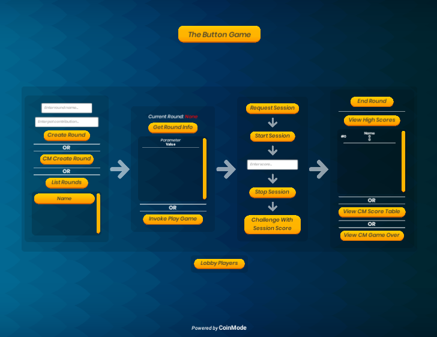

# CoinMode Unity Plugin

This plugin is designed to simplify the process of implementing CoinMode client services into any Unity project. The plugin offers many different levels of entry based on your needs. To get up and running quickly please refer to the getting started section, otherwise this readme contains all information needed to understand how to use the individual components of this plugin.

The plugin is distributed as a **full project** with examples and a standalone **unity package** of plugin only, the steps within this readme references content readily available in both.

Visit our [website coinmode.com](https://coinmode.com/) and sign into a developer account to set up your titles and games. Also please refer to our [api documentation at api.coinmode.com](https://api.coinmode.com/docs/) for further information regarding the API calls this client uses.

## Overview

The plugin framework can be broken down into three main layers, each aiming to simplify the integration process of CoinMode services more so than the previous.

Layer | Description
--- | --- 
**Core** | This is the very base implementation of all CoinMode client functionality. Built directly ontop of the web api with unique classes used to represent each api response.
**Component** | Network calls, expected workflows and design patterns are wrapped up within helper classes designed to simplify the accessibility of tasks within a defined group, e.g: all player actions are bundled together under a single PlayerComponent class.
**UI** | The highest level of implementation for the CoinMode client services. Built on top of the component layer leveraging their functionality to perform common tasks while presenting data and each task to the user in a fully functional responsive user interface.

When getting started using CoinMode it is highly recommend to first implement services utilising the **UI layer**. However if you wish to implement a bespoke solution you can interface with the plugin at the Component or Core layer.
You may of course directly interact with the CoinMode API if preferred, this library is merely to simplify integrations.

All above layers are distributed as full modifiable source code within a single assembly for reference.
Whilst you are free to directly modify these libraries as needed, keep in mind that any customisations to the plugin may cause future work for yourself when upgrading Unity.

## Supported Unity Versions

Version | Support
--- | --- 
2017 | ❌
2018 | ✅
2019 | ✅
2020 | ✅
2021 | ❌

Further engine support to be added over time, please contact support@coinmode.com if there is a particular version you need.

## Example Project

If you download the full project source it is packaged with an example scene that is designed to demonstrate the flow of events when working with CoinMode services.

This example demonstrates how to work alongside the component and the UI layers of the plugin.

Each button within the example scene with a label beginning with CM invokes a built in CoinMode UI function.

The Example scene should look like this when opened:

The code within this example is designed to function as a reference point for working both with the UI and the Component layers of the plugin. 

If you want to work directly with the Core layer you should reference the Component classes to understand how the requests are made and responses are handled.

## Documentation

Full documentation for this plugin can be found at [docs.coinmode.com](https://docs.coinmode.com) - [Unity Plugin Docs](https://docs.coinmode.com/docs/User%20Guide/Developer%20Guilde/Engine%20Plugins/Unity/Introduction)

## Development of Plugin, Contributions, Bug Reporting etc.

>TO DO

## More information

>TO DO

## License

>TO DO